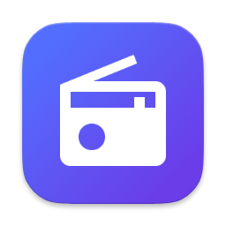

<div align="center">



# Aether Radio — Desktop

### Native world radio for **macOS**, **Windows** and **Linux**

<p>
  
  
  
  
  
</p>

</div>

---

An Electron desktop client for Aether Radio — 50,000+ stations, song recognition, favorites, history, sleep timer, 12 accent themes and a tray-aware, globally keybinded experience. Built on Clean Architecture with a hardened main-process IPC surface and an encrypted, versioned local store.

## ✨ Highlights

- 🍎 **Native on every OS.** Apple-silicon + Intel DMGs, NSIS installer & portable EXE on Windows, AppImage + `.deb` on Linux.
- 🔕 **Runs in the background.** Closing the window hides the app to the system tray — audio keeps flowing until you explicitly quit.
- ⌨️ **Global media keys.** Play/Pause, Stop, Next — wired via `globalShortcut` so they work whether Aether is focused or not.
- 🖼️ **OS Now-Playing widgets.** macOS menu bar + Control Center, Windows SMTC and Linux MPRIS via `MediaSession`.
- 🔊 **CORS-free streaming.** The main process injects `Access-Control-Allow-Origin: *` onto audio responses via `session.webRequest`, so every Icecast/Shoutcast stream plays in the renderer.
- 🎙️ **Song recognition.** Live PCM sampling in the renderer, signature generation + Shazam lookup in the main process via [`node-shazam`](https://www.npmjs.com/package/node-shazam).
- 💾 **Restored window state.** Size, position and maximize state persist across launches.
- 🛡️ **Hardened security.** `contextIsolation: true`, `nodeIntegration: false`, `sandbox: true`. All communication goes through a typed `electronAPI` preload bridge.

## 📦 Download

Prebuilt installers live on the [GitHub Releases](https://github.com/MbarkT3STO/Aether-Radio/releases) page.

| OS | Installer | Architectures |
|---|---|---|
| **macOS** | `.dmg` (drag-and-drop) · `.zip` | Apple Silicon (arm64) · Intel (x64) |
| **Windows** | `Aether Radio Setup x.y.z.exe` (NSIS) · `Aether Radio x.y.z.exe` (portable) | x64 |
| **Linux** | `.AppImage` · `.deb` | x64 |

Build reproducibility is handled by `electron-builder` — see [Packaging](#-packaging).

## 🚀 Quick start

```bash
# Install dependencies
npm install

# Start the dev server (Vite + Electron with HMR)
npm run dev

# Type-check only
npm run typecheck

# Production build (main + preload + renderer bundles)
npm run build

# Preview the production build
npm run preview
```

The dev server boots Vite for the renderer, hot-reloads the main and preload bundles, and opens DevTools automatically when `NODE_ENV=development`.

## 📦 Packaging

Cross-platform packaging is driven by `electron-builder` and the `build` block in `package.json`.

```bash
# Auto-detect host OS and build for it
npm run package

# Platform-specific
npm run package:mac      # x64 + arm64 → .dmg + .zip
npm run package:win      # NSIS installer + portable
npm run package:linux    # AppImage + .deb
```

Artifacts land in `release/`. The `nsis` installer offers optional desktop/Start-menu shortcuts and supports custom install directories.

## 🧱 Architecture

```
DesktopApp/
├── src/
│   ├── main/                  ← Electron main process (Node.js context)
│   │   ├── index.ts             Application bootstrap · CORS shim · global shortcuts
│   │   ├── ipc/                 IPC channel contract + handler registry
│   │   │   ├── IpcChannel.ts
│   │   │   ├── IpcHandlerRegistry.ts
│   │   │   └── handlers/        Radio · Favorites · History · Settings · Custom · Window · Recognition
│   │   ├── tray/                TrayManager — dynamic context menu + tooltip
│   │   └── window/              WindowStateManager — size/position/maximize persistence
│   │
│   ├── preload/               ← Context-isolated IPC bridge
│   │   └── preload.ts           Exposes a strictly-typed `window.electronAPI`
│   │
│   ├── domain/                ← Pure TypeScript, zero deps
│   │   ├── entities/            RadioStation · Favorite · PlayHistory · AppSettings · CustomStation · StationSource
│   │   ├── value-objects/       Country · Genre · BitrateRange
│   │   └── repositories/        I*Repository interfaces
│   │
│   ├── application/           ← Use cases + DTOs + Result<T>
│   │   ├── Result.ts
│   │   ├── dtos/
│   │   └── use-cases/           radio · favorites · history · settings · custom-stations
│   │
│   ├── infrastructure/        ← Platform adapters
│   │   ├── api/                 RadioBrowserApiClient · Endpoints · Mapper
│   │   ├── di/                  Container — single-source-of-truth DI
│   │   └── repositories/        Electron*Repository (electron-store) · MultiSourceStationRepository
│   │
│   └── renderer/              ← Browser context (sandboxed)
│       ├── index.html
│       ├── index.ts             App shell · route wiring · OS integration
│       ├── router/              Hash-router
│       ├── views/               Home · Featured · Explore · Search · Favorites · History · Custom · Settings
│       ├── components/          Sidebar · PlayerBar · StationCard · Modals · SleepTimer · Toast
│       ├── services/            AudioService · VisualizerService · SongRecognitionService · BridgeService
│       ├── store/               EventBus · PlayerStore · FavoritesStore (singleton observables)
│       ├── styles/              tokens · accents · typography · layout · animations + component CSS
│       ├── assets/              logo · tray icons · fonts
│       └── utils/               countryFlag · stationLogo · imageErrorHandler · renderCard · assets
│
├── build/                     ← Icons consumed by electron-builder
├── electron.vite.config.ts    ← Main / preload / renderer bundle definitions
├── tsconfig.node.json · tsconfig.web.json
└── package.json               ← Scripts · electron-builder config
```

### Process model

| Process | What runs there | Why |
|---|---|---|
| **Main** | Window lifecycle · tray · global shortcuts · `session.webRequest` CORS shim · IPC handlers · `node-shazam` recognition · `electron-store` persistence. | Only place with Node.js + native access. |
| **Preload** | Bridge script exposing a typed `window.electronAPI`. | Enforces `contextIsolation`; no Node surface leaks to the renderer. |
| **Renderer** | UI · state · audio playback · visualizer · PCM sampling. | Sandboxed, no Node APIs, talks to main via IPC only. |

### Renderer → Main flows

All renderer-originated work travels through `IpcChannel`:

```
radio:search · radio:top · radio:byCountry · radio:byGenre · radio:countries · radio:genres · radio:reportClick
favorites:get · favorites:add · favorites:remove · favorites:export · favorites:import
history:get · history:add · history:clear
settings:get · settings:update
custom:get · custom:add · custom:remove · custom:update
tray:update · tray:toggle-playback · tray:stop
shortcut:toggle-playback · shortcut:stop · shortcut:next-station
window:minimize · window:close · player:state-changed
shell:openExternal · shell:showLogFolder
app:getInfo · recognition:recognize
```

See `src/preload/preload.ts` for the fully-typed renderer-facing API.

### Data persistence

`electron-store` is used as a single JSON-backed keystore named `radiosphere-data`:

- `favorites` — `Favorite[]`
- `history` — `PlayHistory[]` (rolling window)
- `settings` — `AppSettings` (theme, volume, bufferSize, accent, apiMirror, audioOutputDeviceId)
- `customStations` — `CustomStation[]`

Stored at the OS-standard location (`~/Library/Application Support/aether-radio` on macOS, `%APPDATA%/aether-radio` on Windows, `~/.config/aether-radio` on Linux).

### Network

A single `RadioBrowserApiClient` speaks to three community mirrors (Germany, Netherlands, Austria) through `MultiSourceStationRepository`, which:

1. Picks the highest-priority enabled mirror.
2. On failure, transparently fails over to the next one.
3. Merges Radio Browser results with user-added `CustomStation` records.

Audio streaming goes straight from the renderer's `HTMLAudioElement` to the upstream host; CORS is patched on-the-fly by a `session.webRequest.onHeadersReceived` interceptor that only touches audio responses.

## 🎨 Design system

Tokens live in `src/renderer/styles/`:

- **`tokens.css`** — Apple HIG-derived colors, semantic surfaces, separators, materials, typography scale, spacing, motion tokens — in light and dark mode.
- **`accents.css`** — 12 accent palettes: Blue, Indigo, Royal Purple, Purple, Pink, Red, Orange, Green, Mint, Teal, Cyan, Graphite.
- **`typography.css`** — DM Sans display + SF-derived fallbacks + an Apple type scale (Caption through Large Title).
- **`animations.css`** — spring easings, float keyframes, reveal-on-scroll primitives.
- **`components/*.css`** — one stylesheet per UI component (sidebar, player-bar, station-card, modals, …).

Accent and theme are applied via `data-accent` and `data-theme` on `<html>`; switching is instant and doesn't require a restart.

## 🎧 Audio pipeline

```
HTMLAudioElement
   │ (crossOrigin="anonymous" — works because main shims CORS)
   ▼
AudioContext.createMediaElementSource(audio)
   │
   ├── AnalyserNode  →  VisualizerService (canvas, RAF-driven)
   └── destination   →  speakers
```

- **Bitrate buffer presets** — `low` (2s) · `balanced` (6s) · `high` (10s); user-selectable in Settings.
- **Auto-retry** — playback failures retry up to 3 times with a 2s backoff before surfacing a toast.
- **Power-save blocker** — the renderer tells the main process when playback starts/stops; main calls `powerSaveBlocker.start('prevent-app-suspension')` so the OS doesn't throttle the audio thread.
- **Background throttling disabled** — `backgroundThrottling: false` on the `BrowserWindow` prevents audio stutter when the window is minimized or hidden to the tray.

## ⌨️ Keyboard & media controls

| Scope | Shortcut | Action |
|---|---|---|
| Window | `Space` | Toggle play/pause (ignored when a text field is focused). |
| Global | `MediaPlayPause` | Toggle play/pause from anywhere. |
| Global | `MediaStop` | Stop playback. |
| Global | `MediaNextTrack` | Reserved for future playlist navigation. |

Global shortcuts are registered at app-ready and unregistered on `will-quit` to avoid stale handlers across reloads.

## 🎙️ Song recognition

1. The renderer taps the `AudioContext`'s `AnalyserNode`, pulls ~3 seconds of PCM.
2. Samples are passed to the main process via `recognition:recognize` IPC.
3. The main process calls `node-shazam` which handles Shazam's signature protocol + upstream API call.
4. The result — title, artist, album, cover art, Shazam/Spotify/Apple/Deezer/YouTube links — is rendered in a modal with deep-links.

Recognition is opt-in per click. No samples are stored.

## 🧪 Scripts reference

| Script | What it does |
|---|---|
| `npm run dev` | Starts `electron-vite` with HMR for renderer, preload and main. |
| `npm run build` | Bundles main, preload and renderer to `out/`. |
| `npm run preview` | Launches the packaged-style build without installing. |
| `npm run typecheck` | TypeScript strict check (no emit). |
| `npm run package` | Build + `electron-builder` for the host OS. |
| `npm run package:mac` | DMG + ZIP for `x64` and `arm64`. |
| `npm run package:win` | NSIS installer + portable EXE for `x64`. |
| `npm run package:linux` | AppImage + `.deb` for `x64`. |

## 🔐 Security posture

- `contextIsolation: true` · `nodeIntegration: false` · `sandbox: true`
- No remote content loaded outside `ELECTRON_RENDERER_URL` (dev) or the local `renderer/index.html` (prod).
- The preload bridge exposes a narrow, strictly-typed surface — `electronAPI` — and nothing else.
- All outbound HTTP is explicit: Radio Browser API, upstream audio hosts, and (opt-in) Shazam's public endpoint.

## 🤝 Contributing

1. Fork & branch.
2. `npm install` then `npm run dev`.
3. Keep `src/domain/` and `src/application/` platform-agnostic — if it needs Electron, it belongs in `infrastructure/` or `main/`.
4. Run `npm run typecheck` before pushing.

## 📜 License

[MIT](../LICENSE) — © 2026 MBVRK.
